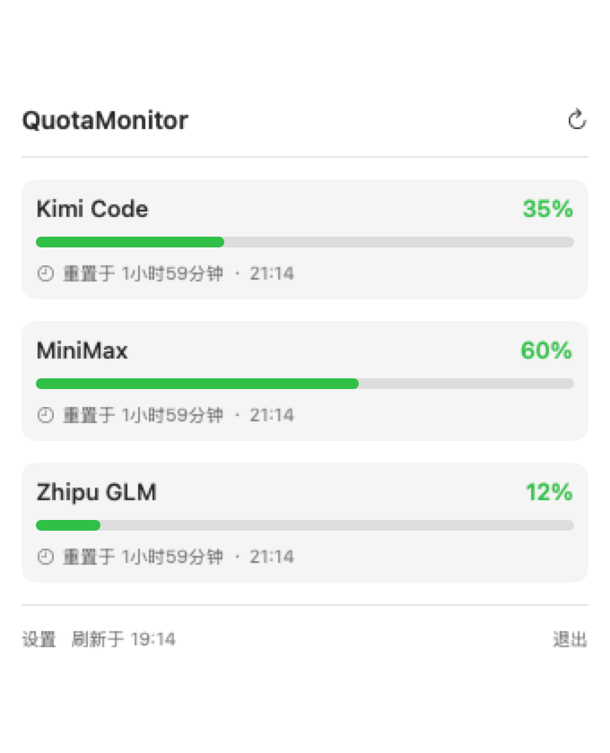
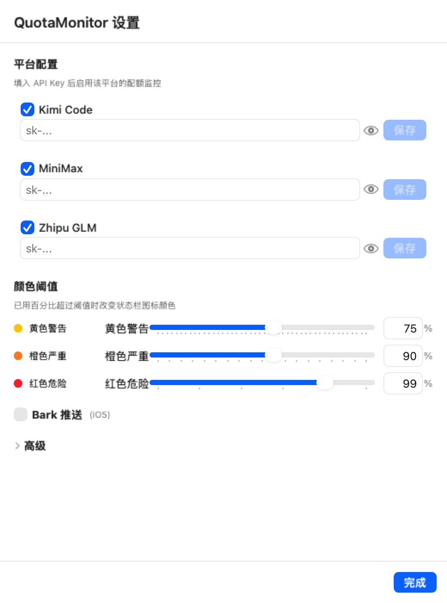

# QuotaMonitor

[](LICENSE)
[](#系统要求)
[](https://swift.org)
[](#单元测试)

macOS 状态栏原生应用，实时监控 Kimi Code / MiniMax / 智谱 GLM 三大 AI 平台的 5 小时滚动配额百分比、剩余量与重置倒计时。

---

## 截图

> 应用启动后驻留在状态栏，点击图标展开下拉面板。
> 状态栏显示格式：`K 35 M 60 G 12`（K/M/G 分别为 Kimi/MiniMax/GLM，后面跟已用百分比）
> 数字颜色按最高已用百分比切换：< 阈值 绿 / 阈值~严重 黄 / 严重~危险 橙 / ≥ 危险 红
> （阈值可在"设置 → 颜色阈值"调节，**支持 slider 拖动 + 数字框直接输入**）

<!-- 待截图后替换：



-->

---

## 功能特性

| 模块 | 实现 |
|------|------|
| 状态栏极简面板 | 单数字 + 颜色状态（绿/黄/橙/红） |
| 三平台并行查询 | actor + withTaskGroup，平均 200ms 内完成 |
| 智能节流轮询 | 30s 活跃 / 1m 普通 / 5m 空闲 / 暂停于系统休眠 |
| 阈值可调 | slider + 数字框双向同步，实时改变状态栏颜色 |
| Keychain 安全存储 | `kSecAttrAccessibleAfterFirstUnlockThisDeviceOnly` |
| 银行级 Key 显示 | LAContext（Touch ID / Apple Watch / 系统密码） |
| 系统通知告警 | UNUserNotificationCenter 3 级 + 5h 窗口去重 |
| Bark 远程推送 | iOS 端轻量 HTTP 推送（可选） |
| 数据平滑 | 防 MiniMax 被动流失导致 UI 闪烁 |
| 设置面板 | API Key 管理 + 阈值调节 + 频率微调 + Bark 配置 |

---

## 系统要求

- macOS 12 (Monterey) 及以上
- Apple Silicon（M1/M2/M3）或 Intel Mac
- 状态栏驻留应用（不显示在 Dock）

---

## 快速开始

### 1. 编译并运行

```bash
# 在项目根目录
swift build -c release

# 打包成 .app（必须，否则 UNUserNotificationCenter 崩溃）
mkdir -p build/QuotaMonitor.app/Contents/MacOS
cp .build/release/QuotaMonitor build/QuotaMonitor.app/Contents/MacOS/QuotaMonitor
codesign --force --deep --sign - build/QuotaMonitor.app

# 启动
open build/QuotaMonitor.app
```

或者用 Xcode 打开 `Package.swift` → Run。

### 2. 配置 API Key

首次启动后点击状态栏图标 → **设置** → 在"平台配置"区填入 API Key：

| 平台 | Key 获取地址 |
|------|-------------|
| Kimi Code | https://kimi.com → 设置 → API Key |
| MiniMax | https://platform.minimax.io → Coding Plan → Key |
| 智谱 GLM | https://bigmodel.cn → API Keys |

填完点击"保存"即可。Key 存到 macOS Keychain，重启不会丢。
**显示已保存的 Key 需要身份验证**（Touch ID / Apple Watch / 系统密码）。

### 3. 启用系统通知

首次启动会弹系统通知授权对话框，同意即可在配额达到阈值时收到原生通知。

### 4. 启用 Bark 推送（可选）

iOS 端装 Bark App → 复制 device key → 设置里勾选"启用 Bark"并粘贴。

---

## 使用技巧

| 场景 | 操作 |
|------|------|
| 手动刷新 | 点击 popup 右上角刷新图标 / 状态栏右键"手动刷新" |
| 改阈值（拖动） | 设置 → 颜色阈值 → 拖动 slider |
| 改阈值（精确） | 设置 → 颜色阈值 → 直接在数字框输入百分比 |
| 暂停某平台 | 设置 → 取消勾选某平台（不再抓取该平台） |
| 退出应用 | 状态栏右键 → 退出 / 或 popup 左下角"退出" |

---

## 技术栈

- **语言**：Swift 5.9+
- **UI**：SwiftUI + AppKit 混合（NSStatusItem + NSPopover + NSHostingView 桥接）
- **网络**：URLSession + async/await
- **并发**：actor + withTaskGroup
- **安全**：Keychain Services + LocalAuthentication
- **通知**：UserNotifications.framework
- **远程推送**：Bark（iOS）

---

## 三大平台 API 关键差异

| 平台 | 端点 | 鉴权陷阱 |
|------|------|---------|
| Kimi | `https://api.kimi.com/coding/v1/usages` | `Bearer` Token + **必须携带 User-Agent `KimiCLI/1.30.0`** |
| MiniMax | `https://api.minimax.io/v1/api/openplatform/coding_plan/remains` | 必须是 Coding Plan Key；`current_interval_remaining_percent` 是"剩余"非"已用"；选 `general` 模型 |
| 智谱 GLM | `https://api.z.ai/api/monitor/usage/quota/limit` | **禁止** `Bearer` 前缀（裸 Token）；响应在 `data.limits`（不在顶层）；5h 配额用 `TOKENS_LIMIT + unit=3`（不是 `TIME_LIMIT + unit=5`） |

详见 [`docs/HANDOFF_v1.0.2_2026-06-17.md`](docs/HANDOFF_v1.0.2_2026-06-17.md) 关键陷阱章节。

---

## 项目结构

```
QuotaMonitor/
  QuotaMonitor/
    App/                     # @main + AppDelegate
    Core/
      Models/                # ProviderKind / ProviderQuota / QuotaWindow / ActivityLevel
      Errors/                # QuotaError
      Protocols/             # Provider / KeychainStoreType
    Services/
      Networking/            # HTTPClient / KimiProvider / MiniMaxProvider / GLMProvider / NetworkingService
      Security/              # KeychainStore
      Throttling/            # SmartRefreshScheduler / SystemActivityMonitor
    State/                   # AppState / QuotaStore / SettingsStore
    UI/
      DesignTokens/          # Spacing / SemanticColors / Typography
      Popup/                 # 4 个 popup 组件
      MenuBar/               # MenuBarController
      Notifications/         # AlertLevel / AlertStateMachine / NotificationManager / BarkClient
      Settings/              # SettingsView + SettingsWindowController
  QuotaMonitorTests/         # 105 个单元测试
  docs/                      # 设计文档 + 各版本交付报告
  .github/                   # Issue / PR 模板
  README.md                  # 本文件
  CHANGELOG.md               # 版本变更历史
  USER_GUIDE.md              # 用户使用指南（图文）
  CONTRIBUTING.md            # 贡献指南
  SECURITY.md                # 安全漏洞报告流程
  LICENSE                    # MIT
  .env.example               # 配置示例
  Package.swift              # Swift Package Manager 配置
```

---

## 单元测试

```bash
swift test
```

**当前：105 个测试用例，全部通过，~0.5s**

| 测试文件 | 用例数 | 验证目标 |
|----------|--------|----------|
| ProviderKindTests | 7 | 3 平台枚举字段 |
| QuotaWindowTests | 6 | 百分比 / remaining 计算 |
| QuotaErrorTests | 11 | 错误矩阵 |
| KeychainStoreTests | 6 | InMemoryKeychain CRUD |
| ProviderQuotaTests | 3 | 5h 窗口指纹 |
| KimiProviderTests | 9 | Kimi 鉴权 + 真实响应解析 |
| MiniMaxProviderTests | 9 | 反直觉字段 + 多 model 选择 |
| GLMProviderTests | 8 | 裸 Token 鉴权 + 5h 窗口识别 |
| NetworkingServiceTests | 5 | 并行 + 平滑 + Key 缺失 |
| SmartRefreshSchedulerTests | 6 | 4 级间隔 + forceTick |
| SettingsStoreTests | 18 | Keychain + UserDefaults 持久化 |
| AlertStateMachineTests | 12 | 3 级阈值 + 5h 去重 |
| BarkClientTests | 4 | URL 构造 + 编码 + 错误 |
| **合计** | **105** | |

---

## 关键文档

- [`CHANGELOG.md`](CHANGELOG.md) — 版本变更历史
- [`USER_GUIDE.md`](USER_GUIDE.md) — 用户使用指南
- [`CONTRIBUTING.md`](CONTRIBUTING.md) — 贡献指南
- [`SECURITY.md`](SECURITY.md) — 安全漏洞报告流程
- [`docs/HANDOFF_v1.0.2_2026-06-17.md`](docs/HANDOFF_v1.0.2_2026-06-17.md) — 完整业务上下文 + 关键技术陷阱
- [`docs/legacy/DECISIONS.md`](docs/legacy/DECISIONS.md) — 1.x QuotaCat → 2.0 QuotaMonitor 决策追溯

---

## 致谢

参考了若干开源项目的架构思想（具体项目待核实补充）。
若本项目对你有帮助，欢迎 Star / Issue / PR。

---

## 许可证

本项目基于 [MIT 协议](LICENSE) 开源。
